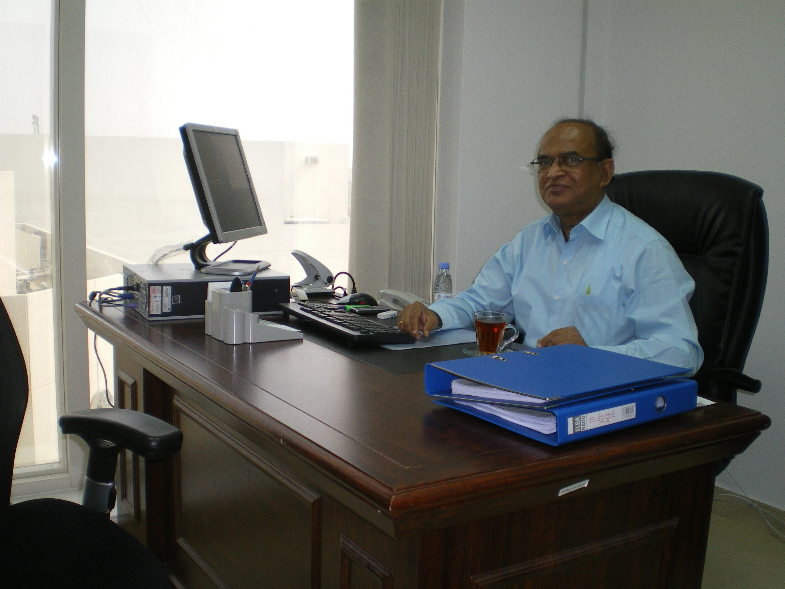

# Asim Raha, BME, ME- Mech

[LinkedIn](https://in.linkedin.com/in/asim-raha-63041b5a), E-mail: raha.asim50@gmail.com, Mobile: +91 7980647752, Whatsapp: +91 9674132370, Residence: +91 33 23596696

## COMPUTER AIDED ENGINEERING (CAE)
Usage of **computer software** to aid in **engineering** analysis including process
simulation, **optimization**, design analysis, proposal work etc. to achieve economic
solution with time saving &amp; quality improvements. The solution tools are offered in user
friendly platforms at very competitive rates.

## SNAPSHOT  
- Optimum production & yield
- Setup process parameters 
- Mill Setup & Pass Schedule
- Complicated calculations using Mathematical Model & set of Algorithms 
- Utility tools for Engineering / Production offices
- Proposal work for Engineering offices with value addition in Rolling Mills & Processing Lines. 

## BENEFITS
- Simulating reality amounts to savings in time and money
- Reduces errors in Engineering & Process
- The impact of changing parameters on a system can be studied with more accuracy
- Allows easy visualization of Process or Designs
